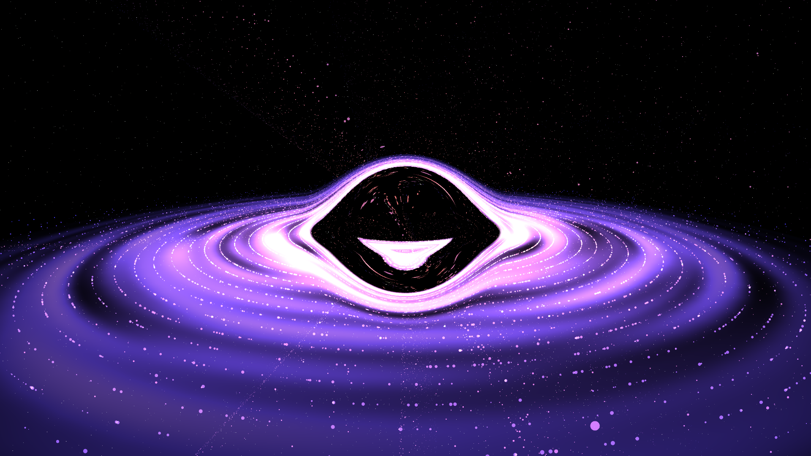

Black Hole Simulation
=====================

A real-time black hole visualization written in **C++** using **OpenGL**, **GLFW**, and **GLAD**.\
The project renders a stylized black hole with an accretion disk, gravitational distortion effects, and interactive camera controls.

* * * * *

Features
--------

-   Real-time OpenGL rendering

-   Black hole event horizon visualization

-   Accretion disk rendering

-   Camera movement and mouse look

-   GLSL shaders

-   Cross-platform build system using CMake

* * * * *

Technologies Used
-----------------

-   **C++17**

-   **OpenGL**

-   **GLFW** --- window/context management

-   **GLAD** --- OpenGL function loader

-   **GLM** --- mathematics library

-   **CMake** --- build system

* * * * *

Screenshot
----------




* * * * *

Project Structure
-----------------

```
BlackHoleSimulation/
├── CMakeLists.txt
├── README.md
├── external/
│   ├── glfw/
│   ├── glad/
│   └── glm/
├── include/
├── src/
├── shaders/
└── assets/

```

* * * * *

Build Instructions
------------------

### Linux / macOS

```
git clone
cd black-hole

mkdir build
cd build

cmake ..
make

./bin/blackhole

```

### Windows

Using Visual Studio:

```
mkdir build
cd build

cmake ..

```

Open the generated `.sln` file in Visual Studio and build the project.

* * * * *

Controls
--------

| Key / Input | Action |
| --- | --- |
| `W A S D` | Move camera |
| `Mouse` | Look around |
| `ESC` | Exit application |

* * * * *

Dependencies
------------

Make sure the following are installed or included as submodules:

-   OpenGL

-   GLFW

-   GLAD

-   GLM

-   CMake (3.16+)

* * * * *

Future Improvements
-------------------

-   Relativistic gravitational lensing

-   Physically accurate ray marching

-   HDR bloom and post-processing

-   Volumetric jets

-   Adaptive timestep simulation

* * * * *

License
-------

This project is licensed under the MIT License.
